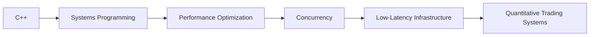

<div align="center">

# Roy 👨‍💻
### C++ • Systems Programming • Quantitative Infrastructure • Performance Engineering


</div>

---

## 🚀 About Me

```cpp
class Roy {
public:
    string role = "Computer Science Undergraduate";
    string focus = "Low-Latency Systems & Quantitative Infrastructure";

    vector<string> interests = {
        "C++ Systems Programming",
        "Algorithmic Problem Solving",
        "Market Microstructure",
        "Performance Optimization",
        "Concurrency & Memory Efficiency"
    };

    void currentGoal() {
        cout << "Building strong foundations for HFT & performance engineering.";
    }
};
```

I enjoy understanding how software behaves under real-world performance constraints —  
especially in systems where **latency, throughput, and execution efficiency** directly impact outcomes.

My primary interests revolve around:
- ⚡ Performance-critical systems
- 🧠 Algorithmic thinking
- 📈 Trading infrastructure
- 🔬 Low-level optimization
- 🖥️ Systems architecture

---

# 🔧 Technical Interests

<div align="center">

| Systems | Algorithms | Quant |
|----------|------------|-------|
| Low-Latency Design | DSA & Competitive Programming | Market Microstructure |
| Concurrency | Optimization Techniques | Trading Infrastructure |
| Memory Management | Problem Solving | Statistical Reasoning |
| Performance Engineering | Efficient Implementations | Quantitative Systems |

</div>

---

# 📚 Currently Learning

```text
✓ Concurrency Fundamentals
✓ Memory-Efficient C++ Design
✓ Statistical & Probabilistic Thinking
✓ Trading System Architecture
✓ Cache-Aware Programming
✓ Performance Profiling
```

---

# 🧠 Problem Solving Journey

### Competitive Programming
- 💻 Active Codeforces participant
- ⚙️ Focused on implementation precision
- 🧩 Practicing efficient algorithms under constraints
- 📈 Improving analytical & optimization skills daily

### Areas I Enjoy
```text
• Binary Search
• Greedy Algorithms
• Dynamic Programming
• Graph Algorithms
• STL Optimization
• Time Complexity Analysis
```

---

# ⚙️ Tech Stack

<div align="center">

## Languages


## Libraries & Tools


</div>

---

# 🎯 Career Direction

> Aspiring to build and optimize performance-critical infrastructure for  
> quantitative trading systems and ultra-low latency applications.

### Target Roles
- Quantitative Developer
- Low-Latency C++ Engineer
- Systems Software Engineer
- Infrastructure Engineer

---

# 📈 Current Focus



---

# 📫 Connect With Me

<div align="center">

[](https://www.linkedin.com/in/sagar-roy-459727357/)

📧 **Email:** `sroy96365@gmail.com`

</div>

---

<div align="center">

### ⚡ "Performance is a feature."

</div>
